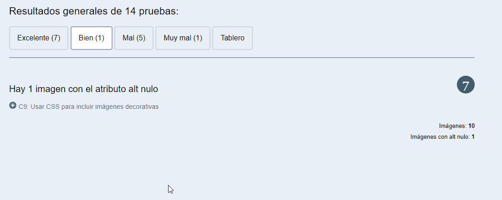
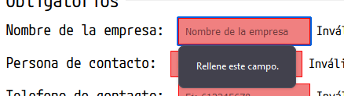
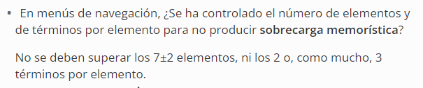

# ACCESIBILIDAD Y USABILIDAD

# 
#
#
#
#
#
#
#
#
#
#
#
> Kevin Martínez Martínez
>
> 2º Desarrollo Aplicaciones Web
>
> Diseño de Interfaces Web
# Accesibilidad y Usabilidad

### Medidas de accesibilidad y usabilidad relacionadas con la navegación.

>Indicar qué medidas se están tomando en la navegación de la página web para cumplir con los requisitos de navegación usable y accesible vistos en la unidad. Indica, al menos, una medida para cada uno de estos apartados:

* Información accesible.

En la siguiente imagen adjunto la barra de navegación la cual todos los enlaces tiene acceso a su página correspondiente:

Y aqui podemos ver el código donde se puede ver los enlaces que le corresponde a cada elemento.

* Consistencia.

En la siguiente imagen podemos ver que dentro del menú de navegación se presenta que cuando pasamos el ratón por encima de un elemento, éste pasa de estar con el color de la fuente en oscuro y el fondo claro, a tener un fondo oscuro y la fuente clara. Además el cursor de nuestro ratón cambia de forma a una mano para dar a entender de que es un enlace y que para acceder debemos clicar en él.

* Persistencia.

En las dos siguientes imágenes podemos obsevar cómo el menú de navegación permanece exactamente en el mismo lugar, justo después de la cabecera.

index.html:

nosotros.html:

* Sencillez de navegación.

En las siguientes imágenes podemos ver la estructura de la navegación con tan sólo mirar el menú de navegación. Además en nosotros.html se preseta una sección "migas de pan" que nos ayuda a saber nuestra ubicación actual, pudiendo interactuar con ella y volver al index.html con sólo clicar en el icono de la casa.

También mencionar que el logo de nuestra empresa, en nosotros.html, nos lleva de vuelta a index.html

* Teclas aceleradoras.

En la siguiente imagen se puede ver cómo se le ha quitado el foco al nombre de la empresa puesto que de momento no queremos que se pueda interactuar con él. Tambien he añadido una tecla rápida a la parte del menú donde pone Desarrollo Software, ya que mediante tabulación es complicado llegar puesto que al llevar un checkbox de fondo y por estética se ha ocultado, pues no podemos ver cómo se interactúa con este apartado. Por lo que al ponerle un acceso rápido con el número 1, éste submenú se abrirá. También se abre sólo con pasar el ratón por encima y si clicamos en él se mantendrá abierto.
Por lo demás no le he asignado ningún tabindex a ninguna otra parte puesto que considero que sigue un orden correcto y su navegación es sencilla.

## Accesibilidad
### Visualizavión en diferentes navegadores

FIREFOX:

CHROME:

Una de las diferencias que encuentro es el cambio de fuente que hay en la parte de interacción en la cabecera:

FIREFOX:

CHROME:

### Evaluación de la accesibilidad

Una decisión que considero bastante importante es la que he mencionado antes en el primer apartado del documento, la de poner una tecla rápida con el número 1, ya que nos permite llegar a toda la navegación.

Otra decisión es la de poner abreviaciones ya que permite al usuario saber qué elementos son los que tiene delante y hacia dónde van dirijidos los enlaces.

### Análisis de la accesibilidad mediante una herramienta automática.

> PRIMER ANÁLISIS:

* Primera nota:

* Primeros excelentes:

* Primeros bienes:

* Primeros males:

* Primeros muy males:

> 3 Mejoras a realizar en mi página web.

1. La primera mejora a realizar va a ser la relacionada con "Muy mal". Resulta que la descripción de los enlaces es poco descriptiva por lo que no se cumple con el criterio de éxito 2.4.9 que consiste en  ayudar a los usuarios a entender el propósito de cada enlace para que puedan decidir si lo quieren seguir. Los enlaces con iguales destinos deben tener las mismas descripciones y aquellos con distintos propósitos y destinos deben tener diferentes descripciones. Como el propósito de cada enlace puede ser identificado por su texto, estos pueden ser entendidos cuando están fuera de contexto, como cuando la aplicación de usuario proporciona una lista con todos los enlaces de la página. De este modo podemos ver cómo queda nuestro menú de navegación:

2. La segunda mejora a realizar está relacionada con "Mal". Resulta que hay un elemento label sin contenido textual por lo que no se cumple el criterio de éxito 1.3.1, que consiste en asegurar que la información y las relaciones implícitas en el formato visual o auditivo se mantengan cuando cambie el formato de la presentación. Por ejemplo, el formato de la presentación cambia cuando un lector de pantalla lee el contenido o cuando se sustituye la hoja de estilo proporcionada por el autor. Y el criterio 4.1.2 que consiste en asegurar que las Ayudas Técnicas (AT) puedan reunir información acerca de, activar (o establecer) y actualizar el estado de los controles de la interfaz de usuario presentes en el contenido. Resulta que en el menú hamburguesa no se puede tener únicamente svg para esa etiqueta por lo que he agregado un span donde dentro pongo el texto "Iconos del menú hamburguesa" y asu vez este span lo pongo como hidden. Así conservamos nuestro menú hamburguesa tal y como está y con la información adecuada:

3. La tercera mejora a realizar también está relacionada con "Mal". Resulta que en el formulario, el contenedor que tiene el formulario dentro, no dispone de una etiqueta que relacione directamente con el mismo formulario, por lo que no cumple con el criterio de conformidad 1.1.1 que consiste en  lograr que la información transmitida por medio de contenido no textual sea accesible mediante el uso de las alternativas textuales. El criterio 1.3.1 el cual está explicado en la mejora anterior. El criterio 3.3.2 que consiste en ayudar a los usuarios a no cometer errores cuando se les requiera el ingreso de datos. Para ayudar a evitar los errores es bueno diseñar interfaces de usuario que proporcionen instrucciones simples y pistas para ingresar la información. Y el criterio 4.1.2. que también se ha explicado en el apartado anterior. Para solucionarlo, lo he que realizado ha sido un pequeño cambio en la parte del desplegable, introduciendo un label dentro del h3 para que cuando se clickee en el h3 también haga referencia al desplegable. Además en los botones de enviar y cancelar he agregao un atriubo title_

Ahora, he ajustado la página para que el resto de las opciones que están fuera del campo de "Excelente" se cambien para que no salga ninguna nota mala.

Por ejemplo, en el nombre de la empresa introduzco que el propio nombre nos lleve al contenido principal de la página y, además le he quitado el tabindex=-1 para que ahora sí coja foco al tabular.

Otro error era el de los enlaces de las herramientas. Tenían exactamente el mismo texto pero llevaban a lugares diferentes por lo que he cambiado el texto de cada enlace.

Después de todos los ajustes vemos la nota final:

Notaciones en Excelente:

### Accesibilidad: análisis del contraste.

En el menú ne navegación y la cabecera, se utiliza una fuente oscura y fondo claro y viceversa. En las siguientes imágenes se puede observar:

También se puede observar en el texto del contenido:

Según el test realizado por la herramienta de webaim (Contrast Checker), se cumplen, con respecto a la fuente y el fondo, los siguientes datos:

Con respecto al color rosa de la página, se ha cambiado a un rosa algo mas oscuro para que pase el test de contraste:

Por lo tanto, en la tabla se ha cambiado el color de la fuente de la cabecera a un color mas claro, en vez de negro para que siga cumpliendo con el test de contraste:

Por último, en el formulario, en los placeholder. Al venir el placeholder de color gris por defecto, he cambiado el color por defecto a negro para que no haya ningún problema de contraste con el fondo de aquellos campos que no sean válidos.

En cada test podemos ver que aquellos contrastes que ponen el WCAG en doble AA es que eestán cumpliendo con el criterio 1.4.3.
En los que ponen el WCAG en triple AAA cumplen con el criterio 1.4.6

Se han modificado los colores a conciencia para que cumplan con ambos requisitos.

## Usabilidad
### Visualización de los diferentes navegadores

Las mayores diferencias que observo son las que hay con respecto a la hora de rellenar los campos en el formulario. El diseño de las advertencias y los campos a rellenar son diferentes:

FIREFOX:

* Advertencia de que hay que rellenar el campo obligatorio:

* Desplegable:

* Inserción de fecha:

CHROME:

* Advertencia de que hay que rellenar el campo obligatorio:

* Desplegable:

* Inserción de fecha:

### Relacionado con los principios de Jacob Nielsen

1. Principio 4: Consistencia y estándares.

En el caso de mi página en la parte de las migas de pan, se puede apreciar el icono de una casa que nos indica que podemos volver al inicio. También en la versión móvil podemos ver en el menú de hamburguesa unos inconos que siguen los estándares como menú, como es el mismo icono del menú hamburguesa y las flechas que nos dan a enteder de que hay mas elemenos o que simplemente podemos volver a dejar el menú como estaba.

2. Principio 5: Prevención de errores.

El formulario de mi página está diseñado para que aparezcan los datos obligatorios de color rojo y que además ponga inválido hasta que no se introduzca un dato válido en cada campo. Además en los placeholder se indican ejemplos o breves intrucciones indicando qué es lo que hay que introducir. También si le damos a enviar el formulario sin  rellenar algún campo obligatorio, el formulario no se enviará y permanecerá con los datos enviados y a la vez nos mostrará un mensaje de que nos faltan campos a rellenar.

### Análisis de usabilidad mediante guía de evaluación heurística.

> Primer fallo encontrado en la página: https://www.juntadeandalucia.es/educacion/portals/web/ced

1. URL: 

La url exacta donde he encontrado uno de los fallos es en la siguiente:

https://www.juntadeandalucia.es/organismos/desarrolloeducativoyformacionprofesional/areas/ensenanzas-escolarizacion/educacion-infantil.html

Para llegar a ella desde la primera URL se debe clicar en el menú de navegación en la sección alumnado y después seleccionar "Educación infantil"

2. Captura de pantalla:

Aquí podemos ver la página a la que nos lleva:

3. Pregunta:
 ¿Existen elementos de navegación que orienten al usuario acerca de dónde está y cómo deshacer su navegación?

4. Origen de la pregunta:

Guía de evaluación heurística sugerida por el profesor en el apartado 2 de "Información de interés"

5. Justificación:

Contesto NO a esa pregunta puesto que cuando accedemos al apartado de "Educación infantil", directamente se carga en la misma pestaña (sin abrir ventana nueva) otra página que posee una navegación totalmente diferente y que las migas de pan que representa esta página no nos ayuda a volver al inicio (a la página principal de donde venimos).

Aqui vemos la página a la que accedemos:

 y si clicamos en "Inicio" nos lleva al inicio de esa página y no la primera que hemos mencionado:

 

 > Segundo fallo encontrado en la página: https://www.ujaen.es/

 1. URL: 

La url exacta donde he encontrado uno de los fallos es en la misma página principal:

https://www.ujaen.es/

2. Captura de pantalla:

Aquí podemos ver la página a la que nos lleva:

3. Pregunta:

 En menús de navegación, ¿Se ha controlado el número de elementos y de términos por elemento para no producir sobrecarga memorística?

4. Origen de la pregunta:

Guía de evaluación heurística sugerida por el profesor en el apartado 2 de "Información de interés"

5. Justificación:

Contesto NO a esa pregunta puesto que cuando pasamos el ratón por encima del primer elemento de navegación el submenú que abre llega a sobrepasar el número de elementos y da paso a producir una sobrecarga memorística. Puede llegar a abrumar al usuario con un exceso de información.

> Segundo fallo encontrado en la página: https://www.ujaen.es/

 1. URL: 

La url exacta donde he encontrado uno de los fallos es en la siguiente página:

https://www.juntadeandalucia.es/educacion/portals/web/ced/actualidad

2. Captura de pantalla:

Aquí podemos ver la página a la que nos lleva:

3. Pregunta:

¿Se ha controlado la longitud de página?

4. Origen de la pregunta:

Guía de evaluación heurística sugerida por el profesor en el apartado 2 de "Información de interés"

5. Justificación:

Contesto NO a esa pregunta puesto que la información que se muestra en la sección de noticias, para ver todo el contenido, la página requiere hacer scroll bastante largo y además si llegamos al final de la página antes de que siga cargando nos aparecerá un icono indicando que está cargando. Después de esto debemos seguir haciendo scroll si queremos llegar hasta el final. Digamos que da la sensción de ser una página interminable.

