# TECHNETIONS

# 
#
#
#
> Kevin Martínez Martínez
>
> 2º Desarrollo Aplicaciones Web
>
> Diseño de Interfaces Web

# 1.- Bocetos 

## 1.2- Boceto de la página no detallado

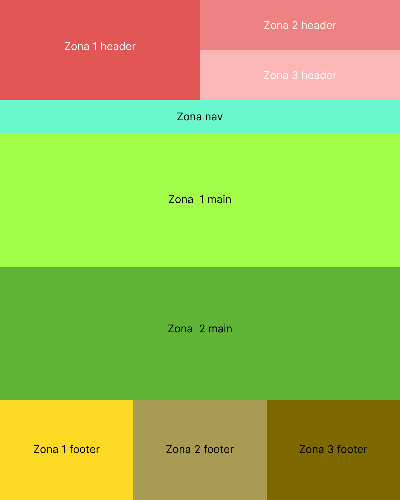

## 1.3- Boceto detallado del footer

## 2.- Variables y fuentes
### 2.1.- Colores
En la selección de colores, he decidido seleccionar una gama de colores turquesa, gris, negro y rosa para dar un contraste.
Se definen las siguientes variables:

* --turquesa: rgba(0, 221, 191, 1);
    * El turquesa irá destinado a la navegación y a partes de contenido mayormente.
* --turquesa_claro: rgba(179, 246, 236,0.8);
    * El turquesa claro para resaltar la fuente ante fondos oscuros.
* --turquesa_oscuro:rgba(44, 68, 78, 1);
    * El turquesa oscuro se utilizará para la cabecera y el pie de página.
* --rosa: rgba(209, 103, 202,1);
    * El rosa para contrastar la gama de colores y para destacar ciertas partes como algunas novedades.
* --negro: #000000;
    * Para títulos, textos y ciertos elementos cuyo fondo sea claro.
* --gris: #c2c2c2;
    * Para títulos, textos y ciertos elementos cuyo fondo sea oscuro.

En el IDE se declara de la siguiente manera:

Ejemplo de la gama de colores:

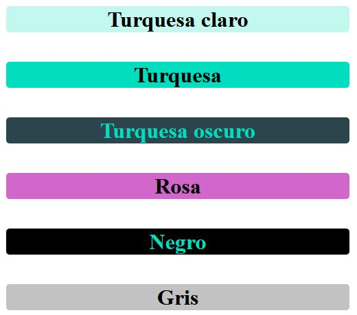

### 2.2.- Fuentes

Para este proyecto se presentan dos fuentes. Estas fuentes están disponibles en https://fonts.google.com/

> Fuente Inconsolata.

* Fuente descargada de manera local.
* Usos: fuente principal de la página (textos, enlaces, etc.)
* Tipo : sans-seriff

Esta fuente se ha descargado previamente y en el código se presenta de la siguiente manera:

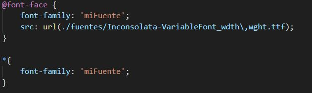

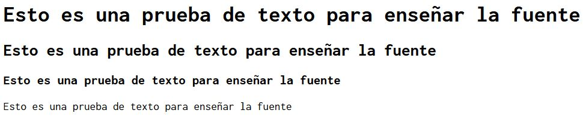

> Fuente M PLUS 1 Code.

* Fuente importada desde internet.
* Usos: títulos, navegación, partes interactivas.
* Tipo : sans-seriff

 Esta fuente, al ser importada, se le pone otra más (monospace) al lado para que, por si fallara la fuente principal, se utilice la otra. El código para importarla se presenta de la siguiente manera:

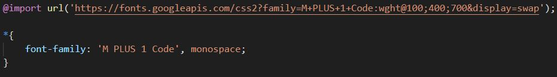

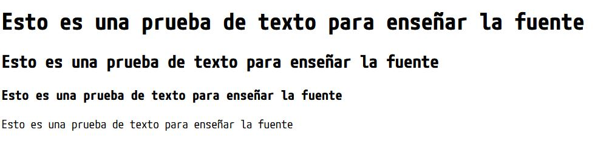

## 3.- Tecnología GRID

En el archivo maquetas.html he realizado una maqueta de la página completa con Grid, proporcionando a cada parte de la página un porcentaje.
Posteriormente me he centrado en la cabecera donde le he puesto una maquetación Grid y he dividido la cabecera en 3 partes.
He utilizado las variables de colores que he establecido en el ejercicio anterior y además he utilizado la fuente importada de internet anteriormente mencionada (M PLUS 1 Code).
El nombre de la empresa está presentado con esta fuente, la cual tiene una separación entre caracteres de 30px, con una doble sombra y además respetando un padding de 40px arriba y abajo. También decir que el nombre está centrado vertical y horizontalmente.

El resto de las zonas se han dejado como están.
Adjunto captura de pantalla de todas las partes de la página exceptuando el pie, que en el ejercicio siguiente se detalla de una manera más concreta:

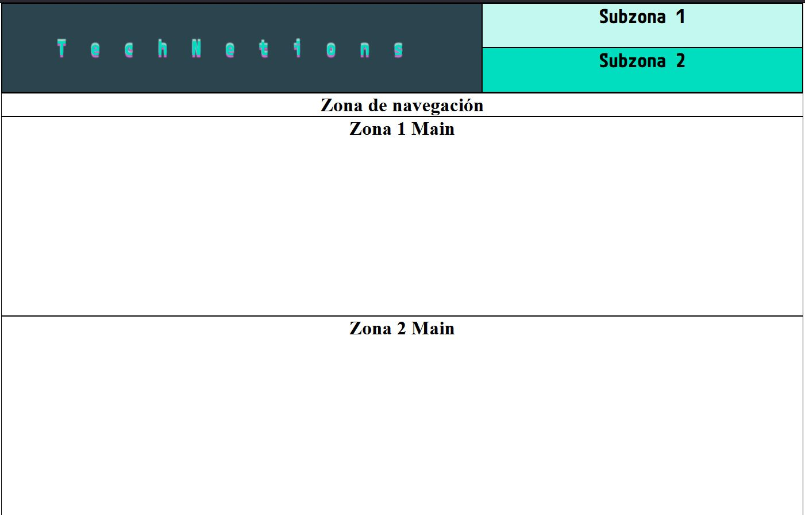

Aquí otra captura de la cabecera para verla más detalladamente y de cerca:

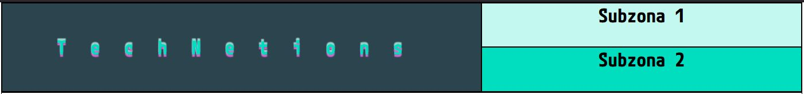

## 4.- Tecnología FLEX

Dentro del mismo archivo, maquetas.html, en la parte del footer he incorporado una maquetación Flex. El footer se constituye por 3 zonas las cuales está dispuestas horizontalmente y con una separación equitativa entre ellas teniendo en cuenta que la primera y la última zona están pegadas al borde y la segunda zona está centrada. Me he permitido la libertad de proporcionar una altura para poder ver con mayor claridad las instrucciones que se le aporta a cada una de las zonas.

El footer dispone de una fuente descargada e importada de manera local. Además le he puesto colores de algunas de las variables declaradas anteriormente (turquesa oscuro para el fondo y turquesa claro para la fuente).

Las tres zonas tienen los elementos centrados verticalmente y cada uno de los elementos está dispuesto como se solicita en la actividad. El nombre pegado a la izquierda con la fuente de tamaño grande, los apellidos pegados a la izquierda con una fuente más pequeña y por último la localidad y provincia, dispuestos con una fuente mediana.

Destacar también que la caja donde están presentados los apellidos se muestra con un sombreado que va de derecha a izquierda y que la localidad y la provincia están separadas por un espaciado de palabras con 30px de distancia y además la localidad se presenta de otro color (rosa).

Aqui se muestra lo descrito:

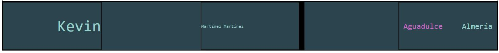

## 5.- Desarrollo página index.html

En esta imagen podemos observar cómo ha quedado el diseño de la página al completo en versión escritorio:

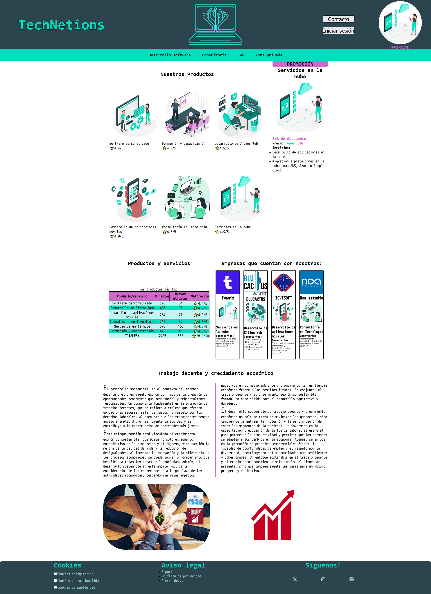

## 6.- Media Query

En esta imagen podemos observar cómo ha quedado el diseño de la página al completo en versión móvil:

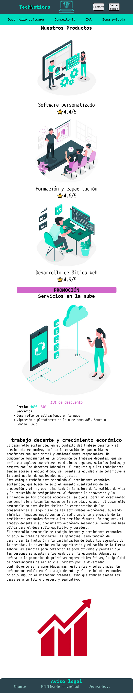

## 7.- Validaciones

A continuación podemos ver cómo se ha validado el html de nuestra página:

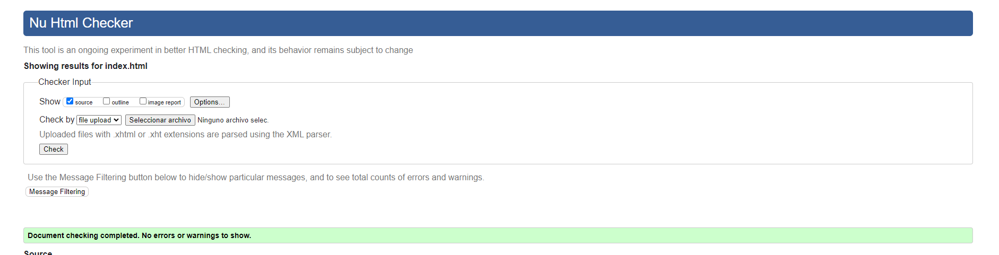

A continuación podemos ver cómo se ha validado el CSS de nuestra página:

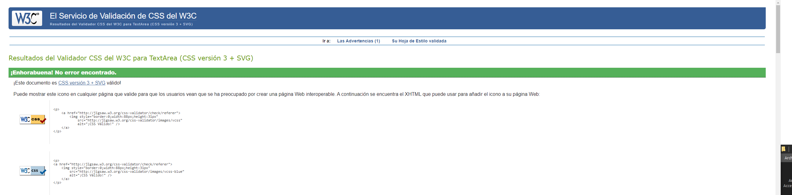

